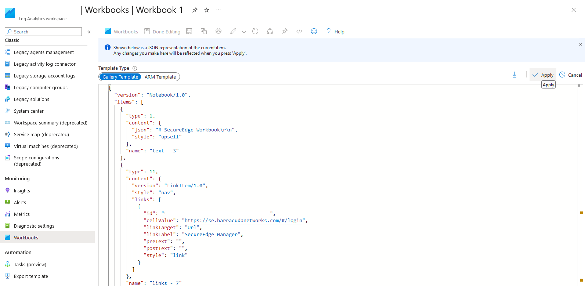

# Barracuda SecureEdge - Log Analytics Workbook

## Introduction
This workbook is intended to improve on the reporting available for the Barracuda SecureEdge.  It provides basic information on:

- VPN Status
- Device Availabilty
- Device Performance
- Device Bandwidth
- WAN Latency and Utilisation

This template will deploy a workbook into a new or existing Log Analytics workspace.

## Deployment

### Quick Deploy

### Deploy to Azure Portal for Workbook only

To manually deploy a workbook via Azure Portal:

- Open https://portal.azure.com
- Navigate to Log Analytics workspaces
- Select your chosen workspace
- From the menu on the left, select Workbooks
- Create New
- Click on the Advanced Editor button 
- Open the [workbook](secureedge.workbook) in Raw mode and copy and paste the contents between GitHub and the editor in the Azure portal, replacing the default template JSON.
- Click on the Apply button.
- Click on the Save button and (optionally) rename the Workbook
- Click Apply
- Click on Done Editing
